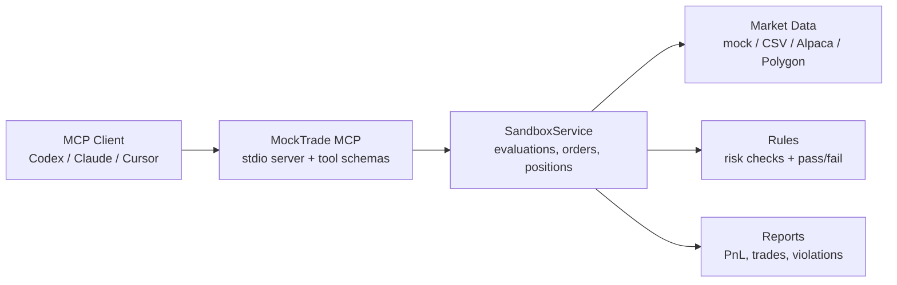

# MockTrade MCP

MockTrade MCP is a local Model Context Protocol server for evaluating AI trading agents. It gives Codex, Claude, Cursor, and other MCP clients a controlled trading sandbox with simulated orders, account state, risk rules, and historical replay backtests.

It is designed for agent evaluation, not live trading. It does not place broker orders and it is not investment advice.

## What It Does

- Runs locally over MCP stdio.
- Creates in-memory trading evaluations with cash, equity, positions, trades, and violations.
- Simulates market orders with fees and slippage.
- Enforces trading rules such as no naked shorts, max position size, max drawdown, daily loss, leverage, profit target, and minimum trading days.
- Supports strict replay backtests where future bars are hidden from the agent.
- Replays market data from deterministic mock bars, local historical CSV files, Alpaca, or Polygon.
- Produces structured PnL reports for agent runs.

## Architecture



## Status

This project is pre-1.0. The default mode is zero-config and deterministic. External market-data providers are optional and require user-supplied credentials.

## Installation

Use directly from npm:

```bash
npx mocktrade-mcp
```

Most users should configure their MCP client to run the npm package directly, rather than cloning this repository.

Codex / TOML-style config:

```toml
[mcp_servers.mocktrade]
command = 'npx'
args = ['-y', 'mocktrade-mcp']
startup_timeout_sec = 30
```

Claude Desktop / JSON-style config:

```json
{
  "mcpServers": {
    "mocktrade": {
      "command": "npx",
      "args": ["-y", "mocktrade-mcp"]
    }
  }
}
```

For local development from a clone:

```bash
git clone https://github.com/jinxiy1104/MockTrader_MCP.git
cd MockTrade_MCP
npm install
npm run build
npm test
```

Run the built MCP server:

```bash
npm start
```

During development:

```bash
npm run dev
```

## MCP Client Configuration

An MCP client is the application that connects to this server. Examples include Codex, Claude Desktop, Cursor, and other agent tools.

If you are developing from a local clone, build first:

```bash
npm run build
```

Codex example on Windows:

```toml
[mcp_servers.mocktrade]
command = 'C:\Program Files\nodejs\node.exe'
args = ['C:\Projects\MockTrade_MCP\dist\index.js']
startup_timeout_sec = 30
```

Claude Desktop / JSON-style config:

```json
{
  "mcpServers": {
    "mocktrade": {
      "command": "node",
      "args": ["C:\\Projects\\MockTrade_MCP\\dist\\index.js"]
    }
  }
}
```

After changing MCP configuration, fully restart the client app and start a new conversation.

## Tools

Market data:

- `list_symbols`
- `get_price`
- `get_bars`
- `list_historical_datasets`

Evaluation and trading:

- `create_evaluation`
- `place_order`
- `get_evaluation_status`
- `get_positions`
- `get_trade_history`
- `get_violations`
- `get_pnl_report`
- `reset_sandbox`

Replay backtesting:

- `create_replay_evaluation`
- `get_visible_bars`
- `advance_time`
- `get_replay_status`

## Quick Smoke Test

From Git Bash on Windows:

```bash
cd /c/Projects/MockTrade_MCP
npm.cmd run build

printf '%s\n' \
'{"jsonrpc":"2.0","id":1,"method":"initialize","params":{"protocolVersion":"2024-11-05","capabilities":{},"clientInfo":{"name":"smoke-test","version":"0.0.0"}}}' \
'{"jsonrpc":"2.0","method":"notifications/initialized","params":{}}' \
'{"jsonrpc":"2.0","id":2,"method":"tools/list","params":{}}' \
| node.exe dist/index.js
```

The response should include tools such as `create_evaluation`, `create_replay_evaluation`, `get_visible_bars`, `advance_time`, and `get_pnl_report`.

## Normal Sandbox Flow

Use normal sandbox mode when you want an agent to trade against deterministic current mock prices.

Typical flow:

1. `create_evaluation`
2. `list_symbols`, `get_price`, or `get_bars`
3. `place_order`
4. `get_positions`, `get_trade_history`, `get_evaluation_status`, and `get_violations`
5. `get_pnl_report`

Example prompt:

```text
Use MockTrade to create an evaluation with default rules, list available symbols, buy 10 shares of AAPL, then show positions, trade history, evaluation status, and violations.
```

## Strict Replay Backtests

Replay mode tests an agent without future price leakage.

`create_replay_evaluation` creates a timeline with:

- `lookbackBars`: bars visible before trading starts
- `tradingSteps`: future bars revealed one step at a time
- `strictMarketData`: blocks normal `get_price` and `get_bars` while future replay bars are hidden
- `dataSource`: `mock`, `historical_csv`, `alpaca`, or `polygon`

During replay, the agent should use `get_visible_bars` for market data. Future bars are hidden until `advance_time` is called. Orders execute at the current replay bar close. Positions are marked to market at the current replay bar close.

`advance_time` accepts either:

```json
{ "steps": 1 }
```

or:

```json
{ "duration": "30m" }
```

Supported duration units are `m`, `h`, and `d`.

Example prompt:

```text
Use MockTrade to create a strict replay evaluation for AAPL with interval 1d, lookbackBars 5, and tradingSteps 5.

Only use get_visible_bars during replay. At each step, inspect visible bars, decide whether to buy, sell, or hold, advance time by 1d, and stop when the replay is finished. Then call get_pnl_report and report final equity, total PnL, trades, positions, and violations.
```

## Historical CSV Data

Local CSV replay is the recommended path for reproducible real historical backtests. It requires no API keys.

Put user-supplied CSV files under:

```text
data/historical/
```

CSV files under `data/historical/*.csv` are ignored by Git. Use names like:

```text
AAPL_1m.csv
AAPL_1d.csv
SPY_1m.csv
SPY_1d.csv
```

Required schema:

```csv
symbol,timestamp,open,high,low,close,volume
AAPL,2024-01-02T14:30:00Z,185.64,185.91,185.52,185.80,123456
```

Use `list_historical_datasets` to confirm the server can see your files.

Example replay arguments:

```json
{
  "dataSource": "historical_csv",
  "datasetDir": "data/historical",
  "symbols": ["AAPL", "SPY"],
  "interval": "1m",
  "start": "2024-01-02T14:30:00.000Z",
  "end": "2024-01-05T21:00:00.000Z",
  "lookbackBars": 390,
  "tradingSteps": 1950,
  "strictMarketData": true,
  "rules": {
    "maxSinglePositionNotional": 1000000,
    "maxDrawdown": 1000000,
    "minTradingDays": 0
  }
}
```

## Alpaca and Polygon

External providers are optional. They require network access and user-supplied credentials.

Create a local `.env`:

```bash
cp .env.example .env
```

Then edit:

```env
ALPACA_API_KEY_ID=your_alpaca_key_id
ALPACA_SECRET_KEY=your_alpaca_secret_key
POLYGON_API_KEY=your_polygon_api_key
```

`.env` and `.env.*` are ignored by Git. Do not paste real API keys into prompts unless you intentionally want the agent to see them.

Alpaca replay example:

```json
{
  "dataSource": "alpaca",
  "symbols": ["AAPL", "SPY"],
  "interval": "1d",
  "start": "2024-01-02T14:30:00.000Z",
  "end": "2024-01-31T21:00:00.000Z",
  "lookbackBars": 5,
  "tradingSteps": 5
}
```

Polygon replay example:

```json
{
  "dataSource": "polygon",
  "symbols": ["AAPL", "SPY"],
  "interval": "1d",
  "start": "2024-01-02T14:30:00.000Z",
  "end": "2024-01-31T21:00:00.000Z",
  "lookbackBars": 5,
  "tradingSteps": 5
}
```

Provider availability, subscriptions, limits, and data licenses are controlled by Alpaca and Polygon.

## Default Rules

Default evaluations start with `$100,000` and use:

- Max drawdown: `$10,000`
- Daily loss limit: `$5,000`
- Profit target: `$10,000`
- Max single-position notional: `$20,000`
- Leverage limit: `2x`
- Minimum trading days: `5`

Rules can be overridden in `create_evaluation` or `create_replay_evaluation`.

## Development

```bash
npm run build
npm test
npm run pack:dry-run
```

Production code lives under `src/`. Tests and small historical fixtures live under `tests/`. User historical datasets should go under `data/historical/` and are ignored by Git.

More examples are available under `examples/`, including MCP client configs, replay prompts, and a sample PnL report.

## Package Contents

The npm package is limited by the `files` field in `package.json` and `.npmignore`. It includes the built `dist/` output, README, license, examples, and `.env.example`. It excludes source references, tests, local datasets, `.env`, and development-only files.

## Safety

MockTrade MCP is a simulation. It does not execute live broker orders, manage real capital, or provide investment advice.
